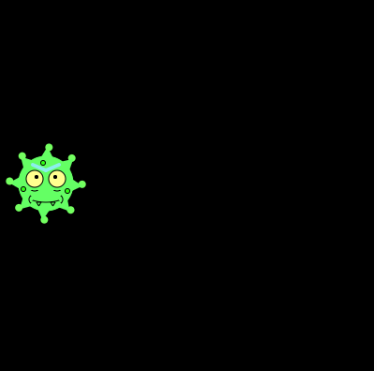
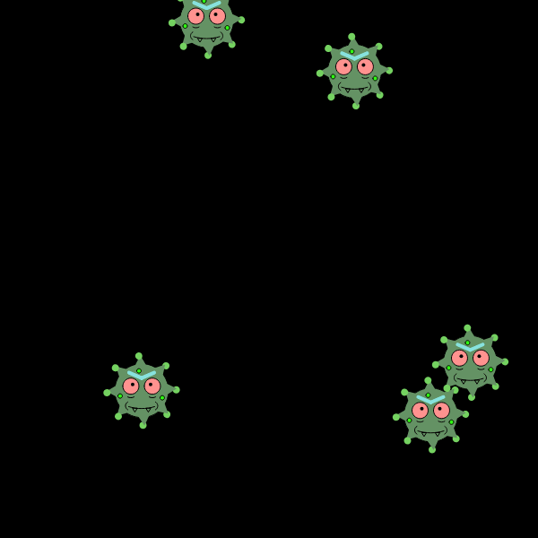

# OOP
In this project, we used the core concepts of object-oriented programming, including the following key points:

Classes and Objects:

We created a class named Ball that has properties and methods that describe the blobs.
Each ball is an instance of the Ball class with separate properties and methods.

Encapsulation:

Encapsulation is the concept of wrapping data and related operations in an object.
In the Ball class, we encapsulate the properties of the ball such as position, radius, and speed, as well as the methods for updating and displaying the ball.


First let's draw a very simple circle
```javascript
function setup() {
  createCanvas(400, 400);
}

function draw() {
  background(200);
  fill(255,0,0);
  ellipse(width/2,height/2,50,50);
}

```
Before learning object-oriented programming, we had actually been doing procedural-oriented programming. This circle we have drawn is not actually an object, so it's very hard for us to modify it. What if we want to do some modifications on what we have drawn. Hence the concept of object need to be brought up.
Now lets look at the basic syntax of OOP
```javascript
class Ball {
  constructor(x, y, radius, speedX, speedY) {
    this.x = x;
    this.y = y;
    this.radius = radius;
    this.speedX = speedX;
    this.speedY = speedY;
  }
}
function setup() {
  createCanvas(400, 400);
}
function draw(){
   
}
```
This code defines a class named Ball, which is a classic example of object-oriented programming (OOP). Let's go through each part of this class definition:
```class Ball { ... }:``` This line starts the definition of a new class named Ball. In OOP, a class is an abstract blueprint that describes a category of objects, in this case, representing balls.

```constructor(x, y, radius, speedX, speedY):``` This is the class constructor. The constructor is automatically called when a new instance (object) of the class is created. It accepts parameters (in this case, x, y, radius, speedX, and speedY) and uses them to initialize the properties of the newly created object.

x: Represents the horizontal position of the ball.
y: Represents the vertical position of the ball.
radius: Represents the radius of the ball, determining its size.
speedX: Represents the speed of the ball in the horizontal direction.
speedY: Represents the speed of the ball in the vertical direction.
this.x = x; and similar statements: These statements assign the values of the constructor's parameters to the properties of the newly created object. The this keyword refers to the current object, allowing us to access and use its properties. So, this.x represents the x property of the object, and it assigns the value of the x parameter from the constructor to this property, making it accessible for later operations.

```javascript
class Ball {
  constructor(x, y, radius, speedX, speedY) {
    this.x = x;
    this.y = y;
    this.radius = radius;
    this.speedX = speedX;
    this.speedY = speedY;
  }
}
function setup() {
  createCanvas(400, 400);
  let ball = new Ball(100, 200, 20, 2, -1);
}
function draw(){
   
}
```
However it now looks like this

This is because we just defined a certain object, but we did not do anything to display it.
Now lets display it
```javascript
class Ball {
  constructor(x, y, radius, speedX, speedY) {
    this.x = x;
    this.y = y;
    this.radius = radius;
    this.speedX = speedX;
    this.speedY = speedY;
  }
  display() {
    fill(255, 0, 0);
    ellipse(this.x, this.y, this.radius * 2);
  }
}
function setup() {
  createCanvas(400, 400);
  let ball = new Ball(100, 200, 20, 2, -1);
}
function draw(){
    ball.display()
}
```
Now let's see the result of the codes


To sum up, the display function we called is to make the ball shown.

Now let us make the ball to move:
```javascript
class Ball {
  constructor(x, y, radius, speedX, speedY) {
    this.x = x;
    this.y = y;
    this.radius = radius;
    this.speedX = speedX;
    this.speedY = speedY;
  }
  display() {
    fill(255, 0, 0);
    ellipse(this.x, this.y, this.radius * 2);
  }
  update() {
    this.x += this.speedX;
    this.y += this.speedY;

    if (this.x + this.radius > width || this.x - this.radius < 0) {
      this.speedX *= -1;
    }
    if (this.y + this.radius > height || this.y - this.radius < 0) {
      this.speedY *= -1;
    }
  }
}
function setup() {
  createCanvas(400, 400);
  let ball = new Ball(100, 200, 20, 2, -1);
}
function draw(){
    ball.display()
    ball.update()
}
```
After having the function update, now we changed the static ball into a bouncing ball.
It looks like this

Here its important to distinguish the differences between ```display``` and ```update```

In p5.js, 'display' is the function used for rendering and showing data or graphics, while 'update' is used to make changes to data or the user interface when dynamic updates are needed. 'display' primarily handles static content presentation, whereas 'update' is responsible for implementing interactions and dynamic effects. Separating them enhances code maintainability and user experience.


We have already learned to draw a basic bouncing ball, what we are doing now is actually transforming the ball into an object.
Now we know the basic syntax of the OOP, let's make a project based on that:
```javascript
let balls = [];

function setup() {
  createCanvas(400, 400);
}

function draw() {
  background(220);

   for (let i = 0; i < balls.length; i++) {
    let ball = balls[i];
    ball.update();
    ball.display();
  }
}

function mousePressed() {
  for (let ball of balls) {
    let d = dist(mouseX, mouseY, ball.x, ball.y);
    if (d < ball.radius) {
      ball.accelerate();
    }
  }
}

class Ball {
  constructor(x, y, radius, speedX, speedY) {
    this.x = x;
    this.y = y;
    this.radius = radius;
    this.speedX = speedX;
    this.speedY = speedY;
  }

  update() {
    this.x += this.speedX;
    this.y += this.speedY;

    if (this.x + this.radius > width || this.x - this.radius < 0) {
      this.speedX *= -1;
    }
    if (this.y + this.radius > height || this.y - this.radius < 0) {
      this.speedY *= -1;
    }
  }

  display() {
    fill(255, 0, 0);
    ellipse(this.x, this.y, this.radius * 2);
  }

  accelerate() {
    this.speedX *= 1.5;
    this.speedY *= 1.5;
  }
}

function keyPressed() {
  if (key === ' ' && balls.length < 5) {
    let radius = random(10, 50);
    let x = random(radius, width - radius);
    let y = random(radius, height - radius);
    let speedX = random(-3, 3);
    let speedY = random(-3, 3);
    let ball = new Ball(x, y, radius, speedX, speedY);
    balls.push(ball);
  }
}

```

Now we will have a accomplished project, you can add ball by clicking the SPACE and it will accelerate once you clicked on the balls.
Feel Free to copy the code and try it in your own sketch. The final project looks like this:


But so far the project is too tedious and boring, let's built something more interesting with OOP.

Let's make a virus Rick
Here is code to draw the appearance of the virus:
```javascript
class Bubbles {
  constructor(x, y, r) {
    this.x = x;
    this.y = y;
    this.r = r;
    this.colorG = 210;
    this.colorR = 100;
    this.colorB = 100;
    this.isDead = false;
    this.xspeed = random(-4, 4);
    this.yspeed = random(-4, 4);
    
    this.lifespan = 255;
  }
  show() {
    fill(this.colorR, this.lifespan, this.colorB);
    circle(this.x, this.y, this.r);

    push();
    noStroke();
    translate(this.x, this.y);
    for (var i = 0; i < 8; i++) {
      rotate(PI / 4 + 0.015 * sin(frameCount * 0.1));
      noStroke();
      triangle(
        0 - ((this.r / 2) * sin(22.5)) / 2,
        0 - (this.r / 2) * cos(22.5),
        0 + ((this.r / 2) * sin(22.5)) / 2,
        0 - (this.r / 2) * cos(22.5),
        0,
        0 - (((3 / 2) * this.r) / 2) * cos(22.5)
      );
      push();
      fill(
        this.colorR + 16,
        this.colorG - 145 + this.lifespan,
        this.colorB - 4
      );
      circle(0, -this.r / 2 + 10 * cos(22.5), 8);
      pop();

      noStroke();
    }
    pop();

    push();

    translate(this.x, this.y);
    fill(255, this.lifespan, 143);
    circle(-12, -5, 18);
    circle(12, -5, 18);
    stroke(141, 238, 238);
    strokeWeight(4);
    line(-14, -20, 0, -14);
    line(14, -20, 0, -14);
    pop();
    push();
    stroke(141, 238, 238);
    line(-14, -9, 0, -2);
    pop();
    push();
    translate(this.x, this.y);
    strokeWeight(4);
    point(-10, -7);
    point(10, -7);
    strokeWeight(1);
    noFill();
    arc(-12, 1, 14, 14, (1 / 3) * PI, (2 / 3) * PI);
    arc(12, 1, 14, 14, (1 / 3) * PI, (2 / 3) * PI);
    pop();
    push();
    translate(this.x, this.y);
    noFill();
    arc(0, -30, 100, 100, (HALF_PI * 6.5) / 8, (HALF_PI * 9.5) / 8);
    arc(-13, 17, 10, 10, (PI * 2) / 3, (4 / 3) * PI);
    arc(13, 17, 10, 10, (-1 / 3) * PI, (1 / 3) * PI);
    for (var x = -10; x < 10; x += 15) {
      triangle(x, 20, x + 2.5, 24, x + 5, 20);
    }
    pop();
    push();
    translate(this.x, this.y);
    fill(48, 128 + this.lifespan, 20);
    circle(-3, -22, 5);
    circle(-24, 6, 5);
    circle(23, 8, 5);

    pop();
  }
}

function setup() {
  createCanvas(400, 400);
}

function draw() {
  background(0);
  let x = random(width);
  let y = random(height);
  let r = 60;
  let b = new Bubbles(x, y, r);
  b.show()

  }
```
Here is what the Rick looks like



To make it more playful let us add some behaviors
```javascript
let bubbles = [];
class Bubbles {
  constructor(x, y, r) {
    this.x = x;
    this.y = y;
    this.r = r;
    this.colorG = 210;
    this.colorR = 100;
    this.colorB = 100;
    this.isDead = false;
    this.xspeed = random(-4, 4);
    this.yspeed = random(-4, 4);
    
    this.lifespan = 255;
  }
  show() {
    fill(this.colorR, this.lifespan, this.colorB);
    circle(this.x, this.y, this.r);

    push();
    noStroke();
    translate(this.x, this.y);
    for (var i = 0; i < 8; i++) {
      rotate(PI / 4 + 0.015 * sin(frameCount * 0.1));
      noStroke();
      triangle(
        0 - ((this.r / 2) * sin(22.5)) / 2,
        0 - (this.r / 2) * cos(22.5),
        0 + ((this.r / 2) * sin(22.5)) / 2,
        0 - (this.r / 2) * cos(22.5),
        0,
        0 - (((3 / 2) * this.r) / 2) * cos(22.5)
      );
      push();
      fill(
        this.colorR + 16,
        this.colorG - 145 + this.lifespan,
        this.colorB - 4
      );
      circle(0, -this.r / 2 + 10 * cos(22.5), 8);
      pop();

      noStroke();
    }
    pop();

    push();

    translate(this.x, this.y);
    fill(255, this.lifespan, 143);
    circle(-12, -5, 18);
    circle(12, -5, 18);
    stroke(141, 238, 238);
    strokeWeight(4);
    line(-14, -20, 0, -14);
    line(14, -20, 0, -14);
    pop();
    push();
    stroke(141, 238, 238);
    line(-14, -9, 0, -2);
    pop();
    push();
    translate(this.x, this.y);
    strokeWeight(4);
    point(-10, -7);
    point(10, -7);
    strokeWeight(1);
    noFill();
    arc(-12, 1, 14, 14, (1 / 3) * PI, (2 / 3) * PI);
    arc(12, 1, 14, 14, (1 / 3) * PI, (2 / 3) * PI);
    pop();
    push();
    translate(this.x, this.y);
    noFill();
    arc(0, -30, 100, 100, (HALF_PI * 6.5) / 8, (HALF_PI * 9.5) / 8);
    arc(-13, 17, 10, 10, (PI * 2) / 3, (4 / 3) * PI);
    arc(13, 17, 10, 10, (-1 / 3) * PI, (1 / 3) * PI);
    for (var x = -10; x < 10; x += 15) {
      triangle(x, 20, x + 2.5, 24, x + 5, 20);
    }
    pop();
    push();
    translate(this.x, this.y);
    fill(48, 128 + this.lifespan, 20);
    circle(-3, -22, 5);
    circle(-24, 6, 5);
    circle(23, 8, 5);

    pop();
  }

  move() {
    this.x = this.x + this.xspeed;
    this.y = this.y + this.yspeed;
    if (frameCount % 60 == 0) {
      this.lifespan -= 5;
    }
  }
  bounce() {
    if (this.x+this.r/2+5 > width || this.x-this.r/2 -5< 0) {
      this.xspeed = this.xspeed * -1;
      
      
    }
    if (this.y+this.r/2+5> height || this.y-this.r/2-5 < 0) {
      this.yspeed = this.yspeed * -1;
      
}

function setup() {
  createCanvas(400, 400);
}

function draw() {
  background(0);
  if (bubbles.length >= 0 && bubbles.length < 5) {
      let x = random(width);
      let y = random(height);
      let r = 60;
      let b = new Bubbles(x, y, r);
      bubbles.push(b);
    }

  or (var i = 0; i < bubbles.length; i++) {
    bubbles[i].move();
    bubbles[i].bounce();
    bubbles[i].show();
  }
```
Like the previous tutorial about bouncing ball above, we can make a bouncing Virus Rick through the code
Also one quick trick to make the bouncing virus more practical is to make sure when the edge of the ball touches the wall, it bounces.
And the way to fulfil it is to use half of the diameter to calculate the position of the ball's edge. Take ```this.x+this.r/2+5 > width``` for example
And now it looks like this 

Still this is just like a higher advanced bouncing ball let's make some change to it's appearance.
```javascript
let bubbles = [];
class Bubbles {
  constructor(x, y, r) {
    this.x = x;
    this.y = y;
    this.r = r;
    this.colorG = 210;
    this.colorR = 100;
    this.colorB = 100;
    this.isDead = false;
    this.xspeed = random(-4, 4);
    this.yspeed = random(-4, 4);
    
    this.lifespan = 255;
  }
  show() {
    fill(this.colorR, this.lifespan, this.colorB);
    circle(this.x, this.y, this.r);

    push();
    noStroke();
    translate(this.x, this.y);
    for (var i = 0; i < 8; i++) {
      rotate(PI / 4 + 0.015 * sin(frameCount * 0.1));
      noStroke();
      triangle(
        0 - ((this.r / 2) * sin(22.5)) / 2,
        0 - (this.r / 2) * cos(22.5),
        0 + ((this.r / 2) * sin(22.5)) / 2,
        0 - (this.r / 2) * cos(22.5),
        0,
        0 - (((3 / 2) * this.r) / 2) * cos(22.5)
      );
      push();
      fill(
        this.colorR + 16,
        this.colorG - 145 + this.lifespan,
        this.colorB - 4
      );
      circle(0, -this.r / 2 + 10 * cos(22.5), 8);
      pop();

      noStroke();
    }
    pop();

    push();

    translate(this.x, this.y);
    fill(255, this.lifespan, 143);
    circle(-12, -5, 18);
    circle(12, -5, 18);
    stroke(141, 238, 238);
    strokeWeight(4);
    line(-14, -20, 0, -14);
    line(14, -20, 0, -14);
    pop();
    push();
    stroke(141, 238, 238);
    line(-14, -9, 0, -2);
    pop();
    push();
    translate(this.x, this.y);
    strokeWeight(4);
    point(-10, -7);
    point(10, -7);
    strokeWeight(1);
    noFill();
    arc(-12, 1, 14, 14, (1 / 3) * PI, (2 / 3) * PI);
    arc(12, 1, 14, 14, (1 / 3) * PI, (2 / 3) * PI);
    pop();
    push();
    translate(this.x, this.y);
    noFill();
    arc(0, -30, 100, 100, (HALF_PI * 6.5) / 8, (HALF_PI * 9.5) / 8);
    arc(-13, 17, 10, 10, (PI * 2) / 3, (4 / 3) * PI);
    arc(13, 17, 10, 10, (-1 / 3) * PI, (1 / 3) * PI);
    for (var x = -10; x < 10; x += 15) {
      triangle(x, 20, x + 2.5, 24, x + 5, 20);
    }
    pop();
    push();
    translate(this.x, this.y);
    fill(48, 128 + this.lifespan, 20);
    circle(-3, -22, 5);
    circle(-24, 6, 5);
    circle(23, 8, 5);

    pop();
  }

  move() {
    this.x = this.x + this.xspeed;
    this.y = this.y + this.yspeed;
    if (frameCount % 60 == 0) {
      this.lifespan -= 5;
    }
  }
  bounce() {
    if (this.x+this.r/2+5 > width || this.x-this.r/2 -5< 0) {
      this.xspeed = this.xspeed * -1;
      
      
    }
    if (this.y+this.r/2+5> height || this.y-this.r/2-5 < 0) {
      this.yspeed = this.yspeed * -1;
      
}

  die(){
  if (frameCount % 60 == 0) {
        this.lifespan -= 5;
      }
  if (this.colorG - this.lifespan > 0) {
        this.isDead = true;
      }
  }
  
  enlarge(){
    if(this.isDead ==true){
      this.r=70
      var xspeed2=this.xspeed*0.01
      var yspeed2=this.yspeed*0.01
      this.x-=xspeed2
      this.y-=yspeed2 
    }
  }


}

function setup() {
  createCanvas(400, 400);
}

function draw() {
  background(0);
  if (bubbles.length >= 0 && bubbles.length < 5) {
      let x = random(width);
      let y = random(height);
      let r = 60;
      let b = new Bubbles(x, y, r);
      bubbles.push(b);
    }

  or (var i = 0; i < bubbles.length; i++) {
    bubbles[i].move();
    bubbles[i].bounce();
    bubbles[i].show();
  }
```

We USED:
```if (frameCount % 60 == 0) {
      this.lifespan -= 5;}
```
This means for every one second, the lifespan of the virus will minus 5, we are now making the lifespan more dynamic
So we can make some differences through time. 
By using```this.r=70```, we increased the diameter of the Virus
```var xspeed2=this.xspeed*0.01
      var yspeed2=this.yspeed*0.01
      this.x-=xspeed2
      this.y-=yspeed2```  
      
      The usage of which is to make it slower.
To make the virus's color change through time, here is what we have done. 
```this.colorG - 145 + this.lifespan```
We control the color by using the variable the lifespan we claimed in constructor.


CHECK the new image 

